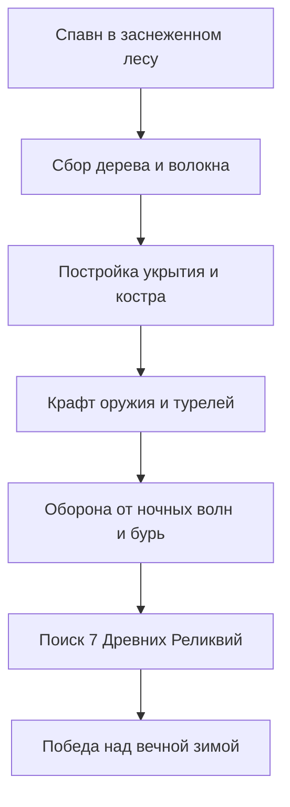
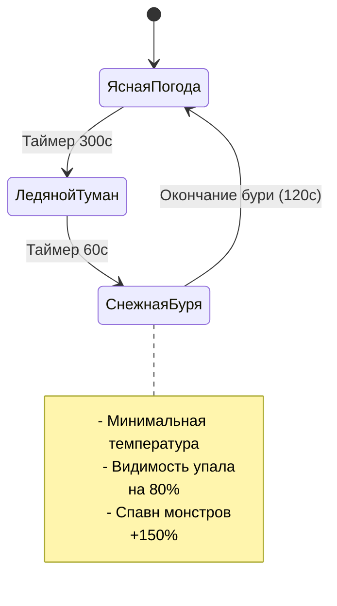
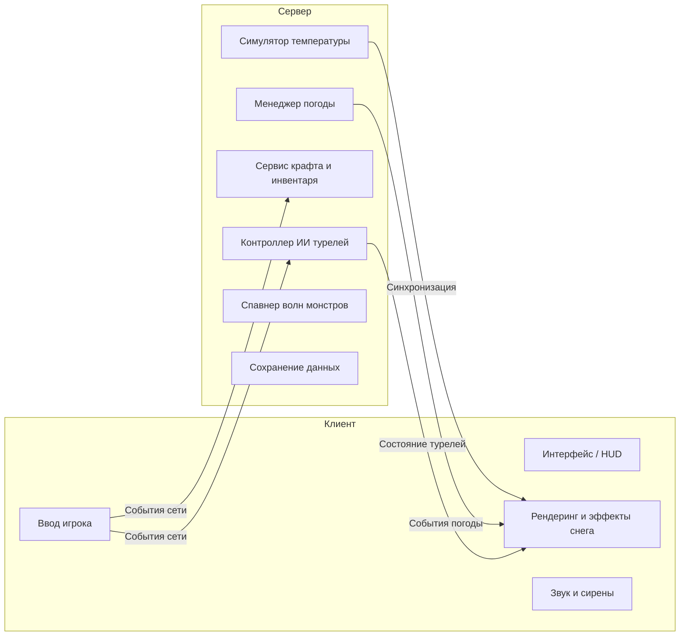
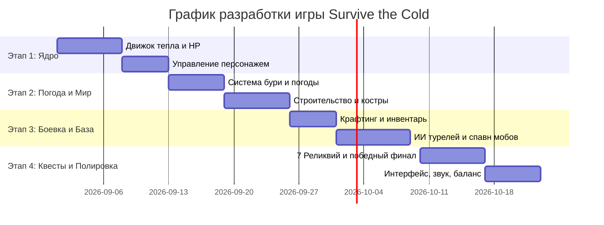

# Дизайн-документ (GDD) и Техническая Архитектура: *Survive the Cold* («Выживание на морозе»)

## 1. Концепция и ключевые особенности

### 1.1 Высокоуровневая концепция
**Survive the Cold** — это кооперативная игра на выживание и оборону базы в условиях суровой вечной зимы. Игроки появляются в заснеженной глуши и должны поддерживать температуру тела, добывать ресурсы, строить укрытия, крафтить автоматические турели, отбивать ночные нападения монстров и исследовать опасные зоны карты, чтобы собрать **7 Древних Реликвий** и навсегда снять ледяное проклятие.



### 1.2 Столпы геймплея
1. **Термодинамика и выживание**: Мороз опасен так же, как и монстры. Управление теплом требует постоянного планирования.
2. **Инженерная оборона**: Постройка барьеров, стен и автоматических турелей для защиты костра и базы.
3. **Исследование и квесты**: Вылазки из безопасной зоны в замерзшие пещеры и руины за 7 реликвиями.
4. **Командное взаимодействие**: Разделение ролей (добытчики, строители, инженеры-оборонщики, охотники за реликвиями).

---

## 2. Игровые механики и системы

### 2.1 Механика тепла и замерзания (Warmth & Freeze)
У игрока есть шкала **Тепла** ($0 - 100\%$), Здоровья (HP) и Выносливости (Stamina).

#### Формула изменения тепла
$$\text{ИзменениеТепла} = \text{ОкрТемпература} + \sum \text{ИсточникиТепла} + \text{БонусОдежды} - \text{ШтрафБури}$$

| Условие / Локация | Модификатор темп. | Эффект на шкалу тепла |
| :--- | :--- | :--- |
| **День (Ясно)** | $-0.5 / \text{сек}$ | Медленное остывание |
| **Ночь** | $-1.5 / \text{сек}$ | Умеренное остывание |
| **Снежная буря (Близзард)** | $-4.0 / \text{сек}$ | Критическое замерзание |
| **Около Костра / Факела** | $+3.0 \dots +8.0 / \text{сек}$ | Быстрый обогрев |
| **Внутри Дома (Закрытого)** | $+2.0 / \text{сек}$ base | Защита от ветра и холода |

#### Стадии гипотермии
- ** Тепло $75\% - 100\%$**: Нормальное состояние, стандартная скорость.
- ** Тепло $40\% - 74\%$**: Охлаждение. Восстановление выносливости снижено на $25\%$.
- ** Тепло $15\% - 39\%$**: Замерзание. Край экрана покрывается инеем, скорость ходьбы $-20\%$.
- ** Тепло $0\%$**: Гипотермия. Игрок получает $5$ урон/сек от мороза до тех пор, пока не согреется или не умрет.

---

### 2.2 Динамическая система погоды (Снежные бури)

Погода циклически меняется между 4 состояниями:



#### Фазы погоды
1. **Ясно (День)**: Отличная видимость, слабый мороз, идеальное время для сбора ресурсов.
2. **Ледяной Туман**: Нарастает туман, мороз усиливается в 2 раза, звучит сирена-предупреждение.
3. **Снежная Буря (Близзард)**: Вой ветра, снежные частицы, сильный урон холодом, спавн агрессивных волн мобов.
4. **Эффект Реликвий**: Каждая найденная Реликвия увеличивает дневную фазу на $+45$ секунд и снижает урон от бури на $10\%$.

---

### 2.3 Сбор ресурсов и Крафтинг

#### Базовые ресурсы
- **Ветки / Древесина**: Добываются с сосен. Нужны для топлива, построек и турелей.
- **Волокно / Сухая трава**: Собирается с кустов. Нужно для веревок, теплой одежды и бинтов.
- **Камень**: Добывается из скал. Нужен для каменных очагов и тяжелых турелей.
- **Железная руда**: Добывается в пещерах. Нужна для брони, металлического оружия и турелей.
- **Осколок Реликвии**: Выбивается при активации реликвии, нужен для энергетических построек.

#### Дерево технологий крафта

```
[Базовый верстак]
  ├── Факел (Древесина + Волокно)
  ├── Костер (Древесина + Камень)
  ├── Деревянная стена (Древесина)
  └── Дротиковая турель (Древесина + Железо)
        │
        ▼
[Продвинутая наковальня]
  ├── Утепленная броня (Волокно + Железо)
  ├── Ледяная пушка (Камень + Железо + Осколок)
  ├── Баллиста (Железо + Древесина)
  └── Тепловой маяк (Камень + Железо + Дерево)
```

---

### 2.4 Система турелей и автообороны

Турели автоматически защищают лагерь и костер от ночных монстров.

| Тип турели | Стоимость | Дальность | Тип урона | Приоритет целей |
| :--- | :--- | :--- | :--- | :--- |
| **Дротиковая** | 20 Дерева, 5 Железа | $12\text{м}$ | Одиночный физ. | Ближайший враг |
| **Огнеметная** | 30 Дерева, 15 Железа, 10 Топлива | $6\text{м}$ | Конус AoE (Огонь) | Группы слабых мобов |
| **Ледяная пушка** | 40 Камня, 20 Железа, 1 Осколок | $16\text{м}$ | Замедление AoE | Быстрые/Летающие |
| **Тесла-вышка** | 50 Железа, 2 Ядра реликвии | $10\text{м}$ | Цепная молния | Враги с высоким HP |

#### Алгоритм прицеливания ИИ турели
```python
def select_target(turret, enemies):
    best_target = None
    highest_score = -float('inf')
    
    for enemy in enemies:
        distance = calculate_distance(turret.position, enemy.position)
        if distance <= turret.range:
            score = (100 / distance) + (enemy.threat_level * 10)
            if enemy.is_attacking_fire:
                score += 50  # Приоритет защите костра
            if score > highest_score:
                highest_score = score
                best_target = enemy
                
    return best_target
```

---

### 2.5 Вражеские мобы и волны

1. **Ледяной Волк**: Быстрый, малый HP, атакует стаями, накладывает замедление.
2. **Замерзший Скелет**: Среднее HP, с мечами или луками, разрушает стены и турели.
3. **Ледяной Голем (Мини-босс)**: Высокое HP, разрушает костры и стены с нескольких ударов.
4. **Вьюжный Призрак**: Летает, игнорирует стены, замораживает костры аурой.

---

### 2.6 Квест «7 Реликвий» и победа

Для победы игроки должны найти и активировать **7 Древних Реликвий**:

1. **Ледяная пещера**
2. **Пик Заснеженной Горы**
3. **Затопленная Шахта**
4. **Древние Руины**
5. **Замерзший Корабль**
6. **Подземное Озеро**
7. **Цитадель Мороза (Финал)**

При доставке всех 7 реликвий на Алтарь наступает **Рассвет**: снежная буря прекращается, мороз спадает, и команда получает победу.

---

## 3. Техническая архитектура

### 3.1 Архитектура Клиент-Сервер



---

## 4. План разработки и этапы



---

> [!NOTE]
> Документ полностью готов! Что именно мы реализуем в первую очередь?
