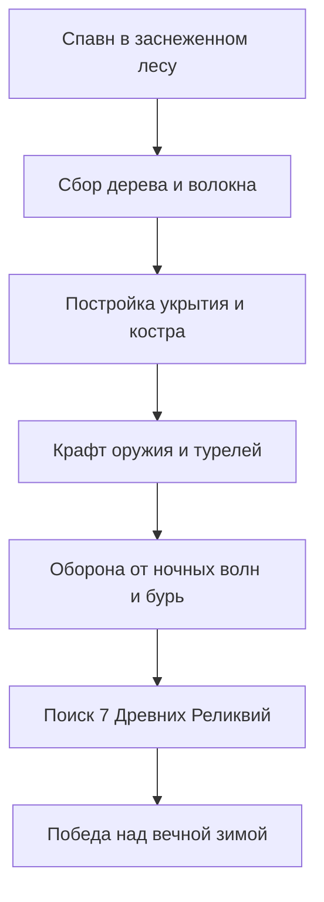
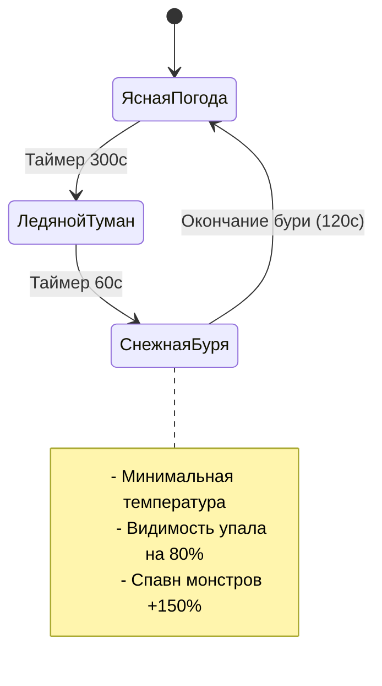
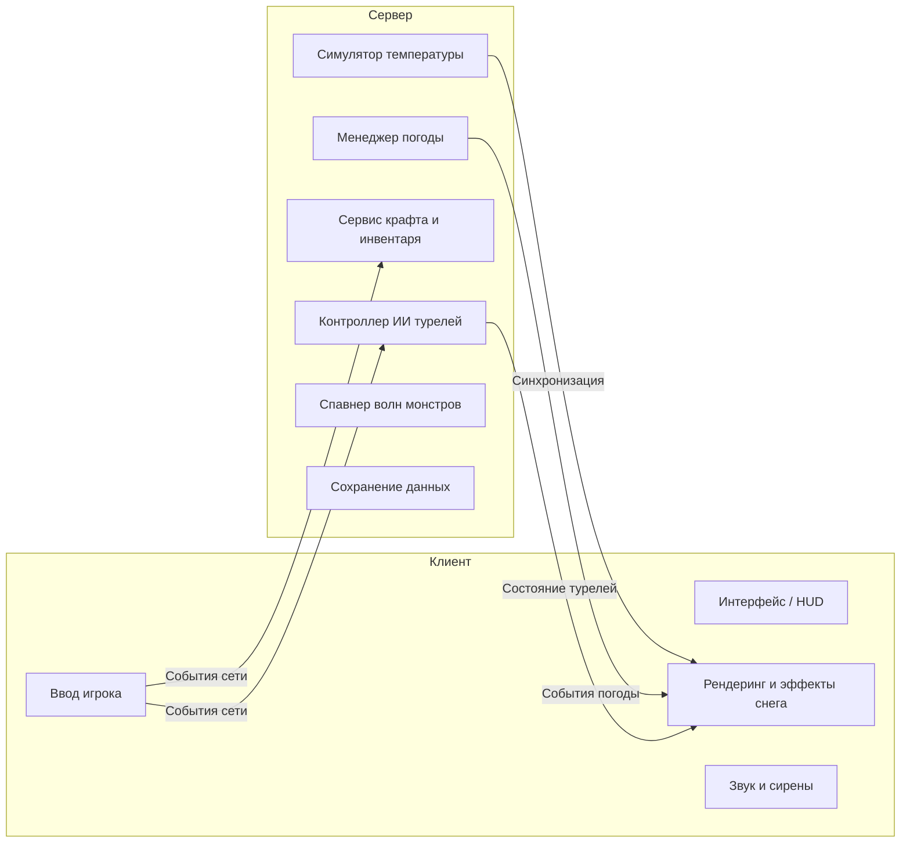

# Дизайн-документ (GDD) и Техническая Архитектура: *Survive the Cold* («Выживание на морозе»)

## 1. Концепция и ключевые особенности

### 1.1 Высокоуровневая концепция
**Survive the Cold** — это кооперативная игра на выживание и оборону базы в условиях суровой вечной зимы. Игроки появляются в заснеженной глуши и должны поддерживать температуру тела, добывать ресурсы, строить укрытия, крафтить автоматические турели, отбивать ночные нападения монстров и исследовать опасные зоны карты, чтобы собрать **7 Древних Реликвий** и навсегда снять ледяное проклятие.



### 1.2 Столпы геймплея
1. **Термодинамика и выживание**: Мороз опасен так же, как и монстры. Управление теплом требует постоянного планирования.
2. **Инженерная оборона**: Постройка барьеров, стен и автоматических турелей для защиты костра и базы.
3. **Исследование и квесты**: Вылазки из безопасной зоны в замерзшие пещеры и руины за 7 реликвиями.
4. **Командное взаимодействие**: Разделение ролей (добытчики, строители, инженеры-оборонщики, охотники за реликвиями).

---

## 2. Игровые механики и системы

### 2.1 Механика тепла и замерзания (Warmth & Freeze)
У игрока есть шкала **Тепла** ($0 - 100\%$), Здоровья (HP) и Выносливости (Stamina).

#### Формула изменения тепла
$$\text{ИзменениеТепла} = \text{ОкрТемпература} + \sum \text{ИсточникиТепла} + \text{БонусОдежды} - \text{ШтрафБури}$$

| Условие / Локация | Модификатор темп. | Эффект на шкалу тепла |
| :--- | :--- | :--- |
| **День (Ясно)** | $-0.5 / \text{сек}$ | Медленное остывание |
| **Ночь** | $-1.5 / \text{сек}$ | Умеренное остывание |
| **Снежная буря (Близзард)** | $-4.0 / \text{сек}$ | Критическое замерзание |
| **Около Костра / Факела** | $+3.0 \dots +8.0 / \text{сек}$ | Быстрый обогрев |
| **Внутри Дома (Закрытого)** | $+2.0 / \text{сек}$ base | Защита от ветра и холода |

#### Стадии гипотермии
- ** Тепло $75\% - 100\%$**: Нормальное состояние, стандартная скорость.
- ** Тепло $40\% - 74\%$**: Охлаждение. Восстановление выносливости снижено на $25\%$.
- ** Тепло $15\% - 39\%$**: Замерзание. Край экрана покрывается инеем, скорость ходьбы $-20\%$.
#### 2.1.1 Управление, Бег и Выносливость (Stamina & Sprint)
- **Клавиша**: Зажатие **`Left Shift`** при движении активирует режим быстрого бега (Спринт).
- **Скорость спринта**: $+70\%$ к базовой скорости передвижения.
- **Шкала выносливости (Stamina)**:
  - Максимум: $100\%$.
  - Расход при спринте: $\sim 30\%$ в секунду.
  - **Механика одышки (Exhaustion)**: При истощении выносливости до $0\%$ спринт немедленно принудительно прекращается, персонаж переходит на шаг.
  - **Возобновление бега**: Повторно начать спринт можно только после того, как выносливость восстановится минимум до **$20\%$**.
  - Регенерация в покое / при шаге: $+25\%$/сек (внутри теплых укрытий и у костров в 2 раза быстрее).
  - Снежный шлейф и ветровая аура визуализируют бег.

#### 2.1.2 Механика Голода и Сытости (Hunger & Nutrition)
У игрока есть шкала **Сытости** ($0 - 100\%$), отображаемая в интерфейсе (`🍗 Сытость`).

* **Расход сытости**:
  - Базовое угасание: $\sim 0.33\%$/сек (полный запас тратится за 5 минут выживания).
  - Спринт (`Shift`): расход ускоряется на $+75\%$ из-за физических нагрузок.
  - Буря / Мороз: дрожь от холода увеличивает расход калорий на $+30\%$.
  - Отдых в доме: сытость расходуется на $40\%$ медленнее.

* **Стадии сытости**:
  - **Сыт ($> 65\%$)**: При достаточном тепле ($> 60\%$) включает пассивную регенерацию здоровья ($+0.9$ HP/сек).
  - **Голоден ($1\% - 25\%$)**: Восстановление выносливости замедляется на $-25\%$.
  - **Критическое истощение ($0\%$)**: Игрок начинает терять здоровье от голодания ($7.2$ урона/сек).

* **Восстановление сытости едой**:
  - 🍫 **Батончик**: `+30% Сытости`, `+15 HP`, `+10% Тепла`.
  - 🍞 **Хлеб**: `+50% Сытости`, `+25 HP`, `+15% Тепла`.
  - 🥔 **Чипсы**: `+25% Сытости`, `+15 HP`, `+8% Тепла`.
  - 🥫 **Суп**: `+70% Сытости`, `+35 HP`, `+30% Тепла`.
  - 🌶️ **Перец**: `+15% Сытости`, `+5 HP`, `+50% Тепла`.
  - ☕ **Кофе**: `+20% Сытости`, `+20 HP`, `+40% Тепла` + ⚡ +35% скорости.
  - 🥩 **Стейк**: `+90% Сытости`, `+60 HP`, `+35% Тепла`.

---

### 2.2 Динамическая система погоды (Снежные бури)

Погода циклически меняется между 4 состояниями:



#### Фазы погоды
1. **Ясно (День)**: Отличная видимость, слабый мороз, идеальное время для сбора ресурсов.
2. **Ледяной Туман**: Нарастает туман, мороз усиливается в 2 раза, звучит сирена-предупреждение.
3. **Снежная Буря (Близзард)**: Вой ветра, снежные частицы, сильный урон холодом, спавн агрессивных волн мобов.
4. **Эффект Реликвий**: Каждая найденная Реликвия увеличивает дневную фазу на $+45$ секунд и снижает урон от бури на $10\%$.

---

### 2.3 Сбор ресурсов, Сундучки Деталей, Шкуры и 5 Уровней Верстака

#### Базовые и редкие ресурсы
- **Ветки / Древесина**: Добываются с деревьев и валежника. Нужны для топлива костра, построек, факелов и пороха.
- **Доски (Древесина)**: Готовые брусья и брёвна для ремонта дома, рюкзаков, стен и верстака.
- **Волокно / Сухая трава**: Собирается с кустов. Нужно для факелов, веревок и одежды.
- **Камень**: Добывается из валунов. Нужен для оружия, снарядов и турелей.
- ⚙️ **Детали (Parts)**: Находятся в **Сундучках Деталей** по всей карте в количестве 1–2 шт. **Стак = 4 шт**. Необходимы для улучшения уровней верстака и турелей.
- 🐺 **Шкура волка (Wolf Pelt)**: Выпадает с убитых волков (шанс 85%). Стак = 5 шт. Используется для крафта рюкзака 2-го уровня, волчьей жилетки и прокачки верстака.
- ❄️ **Шкура Йети (Yeti Pelt)**: Выпадает с убитых снежных людей / Йети (шанс 90%). Стак = 5 шт. Используется для рюкзака 9 слотов, элитной парки и тяжелых турелей.

> 📦 **Сундучки Деталей (Part Chests)**:
> На карте спрятано 16 металлических ящиков с замками (`📦 [⚙️ Сундук Деталей]`). При открытии (`E` или клик) выдают **1–2 штуки Деталей**.

> 🎒 **Стартовый инвентарь**: В начале игры (и при каждом возрождении/перерождении) персонаж начинает с **абсолютно пустым рюкзаком** на 5 слотов. Все ресурсы, еду и материалы игрок добывает самостоятельно в окрестностях.

> 🌲 **Лесополоса вокруг жилого дома (Спавн x2)**:
> В радиусе $130\text{м} - 580\text{м}$ вокруг жилого дома игрока плотность спавна **Веток**, **Досок (Древесины)** и **Волокна (Кустов)** сбалансирована (+18 веток, +12 пачек досок, +14 кустов волокна, +6 камней). Это дает достаточный стартовый запас для починки дома и костра без загромождения карты.

> 🎒 **Сумка боеприпасов (Ammo Pouch)**:
> Снаряды для рогатки (`🪨`) и пули для револьвера (`💥`) **НЕ занимают слоты инвентаря**. Они хранятся в специальном кармане боеприпасов персонажа. Текущее количество патронов отображается в верхнем HUD (`🏹 Боеприпасы: 🪨 50 | 💥 20`) и прямо на иконке оружия в хотбаре.

#### 🛠️ Система 5 Уровней Верстака (Workbench Progression)

Верстак в жилом доме прокачивается с 1 до 5 уровня за **Детали**, **Шкуры** и строительные материалы:

| Уровень верстака | Стоимость улучшения | Доступные чертежи оружия | Доступное снаряжение и постройки |
| :--- | :--- | :--- | :--- |
| **Уровень 1** (Базовый) | *Стартовый* | 🗡️ **Пика (Копье)**: `3 Ветки + 2 Камня` | 🔥 **Факел**: `5 Веток + 5 Волокна` |
| **Уровень 2** (Продвинутый) | `2 ⚙️ Детали + 3 🪵 Доски` | 🏹 **Рогатка (Праща)**: `4 Ветки + 4 Волокна` (+50 снарядов в сумку)<br>🪨 **+50x Снарядов**: `2 Камня` (в сумку боеприпасов) | 🎒 **Рюкзак (7 слотов)**: `3 Доски + 5 Волокна + 1 🐺 Шкура` |
| **Уровень 3** (Инженерный) | `3 ⚙️ Детали + 2 🐺 Шкуры + 4 🪵 Доски` | — | 🛡️ **Защитная стена**: `3 Доски`<br>🏹 **Авто-Турель**: `3 Доски + 5 Камней + 1 ⚙️ Деталь`<br>🦺 **Волчья жилетка**: `2 🐺 Шкуры + 3 Волокна` (Костюм Lvl 2) |
| **Уровень 4** (Оружейный) | `4 ⚙️ Детали + 2 ❄️ Шкуры + 5 🪵 Досок` | 🔫 **Револьвер**: `4 Доски + 6 Камней + 4 Волокна + 2 ⚙️ Детали` (+20 пуль в патронташ)<br>💥 **+20x Пуль**: `2 Камня + 2 Ветки` (в патронташ) | 🎒 **Рюкзак (9 слотов)**: `5 Досок + 5 Волокна + 2 ❄️ Шкуры Йети` |
| **Уровень 5** (Мастерский) | `5 ⚙️ Деталей + 3 ❄️ Шкуры + 6 🪨 Камней` | — | ⚡ **Тяжелая Сдвоенная Турель**: `4 Доски + 6 Камней + 2 ⚙️ Детали + 1 ❄️ Шкура` (Стрельба x2 быстрее, урон 35)<br>🐻 **Меховая парка**: `3 ❄️ Шкуры + 3 🐺 Шкуры + 5 Волокна` (Костюм Lvl 4) |

---
### 2.4 Торговля и Магазины на карте

Магазины открываются **только при нажатии клавиши `E`** (автоматическое всплытие при приближении отключено, чтобы не перекрывать экран во время исследования и боя). На карте размером $12000 \times 12000$ расположены ключевые аванпосты с зонами постоянного обогрева:

1. **🏪 Магазин Одежды**:
   - Манекены с костюмами 1–4 уровней (100% бесплатные, забираются без ресурсов).
   - Манекен VIP 5 уровня за Robux.
2. **🥫 Продуктовый Магазин и Поварня**:
   - Расположен к северо-западу от жилого дома, оборудован горячей печью (`🔥 Печь`).
   - Позволяет обменивать добытые природные ресурсы на питательную горячую еду и согревающие напитки:
     - 🍫 **Энергетический батончик**: `+15 HP`, `+10 Тепла` (🎉 Бесплатный паёк).
     - 🍞 **Питательный хлеб**: `+25 HP`, `+15 Тепла` (2 Ветки).
     - 🥔 **Хрустящие чипсы**: `+15 HP`, `+8 Тепла` (2 Волокна).
     - 🥫 **Горячий мясной суп**: `+35 HP`, `+30 Тепла` (3 Ветки + 2 Волокна).
     - 🌶️ **Огненный перец**: `+5 HP`, `+50 Тепла` (2 Камня + 2 Ветки).
     - ☕ **Горячий кофе (Термос)**: `+20 HP`, `+40 Тепла`, `⚡ +35% Скорость на 15 сек` (3 Ветки + 2 Волокна).
     - 🥩 **Жареный стейк на гриле**: `+60 HP`, `+35 Тепла` (1 Доска + 2 Ветки).

---
### 2.4.1 Система Питомцев (Спасение, Кормление, Баффы и Домашний режим)

Питомцы закованны в ледяные глыбы на карте. Чтобы спасти питомца, игрок должен подойти к нему с горящим факелом в руках (`🔥 Факел`) или в зоне достаточного тепла.

#### 1. Виды питомцев и уникальные баффы:
* 🦊 **Снежный Лис (Snow Fox)**:
  - **Бафф (когда сыт)**: ⚡ *Зоркий нюх & Энергия* (+35% к скорости восстановления выносливости) + 🧭 *Локатор реликвий* (пунктирный компас указывает путь к ближайшей ненайденной реликвии).
  - **Любимая еда**: 🍫 Батончик (`bar`), 🥔 Чипсы (`chips`).
* 🐺 **Ледяной Волчонок (Ice Wolf Pup)**:
  - **Бафф (когда сыт)**: ⚔️ *Охотничий азарт* (+25% к урону всех видов оружия: пики, рогатки, револьвера) + 🏃 *Скорость стаи* (+10% к базовой скорости передвижения).
  - **Любимая еда**: 🥩 Жареный стейк (`steak`), 🥫 Мясной суп (`soup`).
* 🐻 **Полярный Медвежонок (Polar Bear Cub)**:
  - **Бафф (когда сыт)**: 🔥 *Теплая шубка* (+0.35 к постоянному обогреву персонажа даже на морозе) + 🛡️ *Защита от метели* (-25% штрафа к замерзанию во время бури).
  - **Любимая еда**: 🍞 Хлеб (`bread`), 🥩 Жареный стейк (`steak`).

#### 2. Механика сытости, кормления (`F`) и ухода питомца:
* Каждый спасенный питомец имеет шкалу **Сытости ($0 - 100\%$)**.
* При $0\%$ сытости питомец начинает сильно голодать, а его бафф временно отключается.
* **⚠️ Механика ухода при голоде (60 секунд)**:
  - Если питомец находится на $0\%$ сытости более **60 секунд**, он разочаровывается и **навсегда уходит в дикие леса** в поисках пропитания (`💨 Ушёл в дикие леса`).
  - Во время голодания в интерфейсе и над головой питомца идет тревожный обратный отсчет: `⚠️ Уходит через 45с! [F: Покормить]`.
* **Кормление**: Нажатие клавиши **`F`** (или кнопка в панели питомцев) скармливает 1 порцию еды, сбрасывает таймер голода и восстанавливает сытость (+40% обычной едой, +65% любимым лакомством с фонтаном сердечек `❤️`).

#### 3. Выбор активного спутника и домашний режим (`T`):
* Игрок может спасти нескольких питомцев (например, Лиса, Волка и Медведя), но в опасный поход в качестве **активного спутника** берёт одного выбранного:
  1. ⭐ **Активный спутник в походе (`Follow`)**:
     - Бежит рядом с игроком по заснеженной карте.
     - Активирует свой мощный походный бафф (Лис — стамина и поиск реликвий, Волк — урон и скорость бега, Медведь — защита от холода).
  2. 🛏️ **Питомцы дома на лежанке (`Stay at Home`)**:
     - Все остальные питомцы мирно спят в отремонтированном доме у костра на мягкой лежанке (`🛏️ Лежанка питомцев`).
     - Тратят сытость **в 3 раза медленнее**.
     - Охраняют дом и дают **пассивный домашний уют**: костер в доме горит на $+30\%$ дольше, а температура внутри выше.
* **Переключение спутника**:
  - Нажатием клавиши **`T`** игрок быстро циклически переключает активного спутника (🦊 Лис ➔ 🐺 Волк ➔ 🐻 Медведь ➔ 🏡 Все дома).
  - В панели питомцев кнопка `[⭐ Выбрать спутником]` позволяет мгновенно назначить конкретное животное своим напарником, автоматически отправив остальных отдыхать домой на лежанку.

---

### 2.5 Система турелей и автообороны

Турели автоматически защищают лагерь и костер от ночных монстров.

| Тип турели | Стоимость | Дальность | Тип урона | Приоритет целей |
| :--- | :--- | :--- | :--- | :--- |
| **Дротиковая** | 20 Дерева, 5 Железа | $12\text{м}$ | Одиночный физ. | Ближайший враг |
| **Огнеметная** | 30 Дерева, 15 Железа, 10 Топлива | $6\text{м}$ | Конус AoE (Огонь) | Группы слабых мобов |
| **Ледяная пушка** | 40 Камня, 20 Железа, 1 Осколок | $16\text{м}$ | Замедление AoE | Быстрые/Летающие |
| **Тесла-вышка** | 50 Железа, 2 Ядра реликвии | $10\text{м}$ | Цепная молния | Враги с высоким HP |

#### Алгоритм прицеливания ИИ турели
```python
def select_target(turret, enemies):
    best_target = None
    highest_score = -float('inf')
    
    for enemy in enemies:
        distance = calculate_distance(turret.position, enemy.position)
        if distance <= turret.range:
            score = (100 / distance) + (enemy.threat_level * 10)
            if enemy.is_attacking_fire:
                score += 50  # Приоритет защите костра
            if score > highest_score:
                highest_score = score
                best_target = enemy
                
    return best_target
```

---

### 2.5 Вражеские мобы, Опасная зона и Безопасное поселение

#### 1. Зонирование карты $12000 \times 12000$:
* 🛡️ **Западный Безопасный Регион ($X < 6800$)**:
  - Расположен жилой дом игрока ($X = 3200, Y = 5900$), магазины одежды и продовольствия, Алтарь и Бункер.
  - Дикие монстры физически **не могут зайти в этот регион** (автоматический разворот патруля при $X \le 6600$).
  - Дистанция от дома до ближайшей границы обитания врагов составляет более **3600 метров**, гарантируя полную безопасность от видимости и агро-радиуса монстров на базе.
* 🔴 **Восточная Опасная Зона ($X \ge 6800$)**:
  - Дикая глушь с бродячими волками, йети и снежными чудовищами.
  - Враги патрулируют исключительно восточный сектор ($X \ge 7400$) и агрятся только при вторжении игрока в их угодья.

#### 2. Виды врагов и трофеи:
1. **🐺 Лесной Волк (Wolf)**: Патрулирует восточный лес (скорость $1.15$, HP: $30$). При убийстве с вероятностью $85\%$ оставляет `🐺 Шкуру волка`.
2. **❄️ Снежный Человек / Йети (Yeti)**: Массивный медленный исполин (скорость $0.17$, HP: $60$). При убийстве с вероятностью $90\%$ оставляет `❄️ Шкуру Йети`.
3. **🦍 Бигфут (Bigfoot)**: Особо опасный гигант, появляющийся в восточной глуши после бурь (скорость $0.13$, HP: $120$, урон: $0.6$).

---

### 2.6 Квест «7 Реликвий», Алтарь, Бункер и Перерождение (Rebirth)

Для успешного завершения цикла и эвакуации игроки проходят следующую цепочку:

1. **Сбор 7 Древних Реликвий**: Реликвии разбросаны по заснеженной карте в опасных секторах. При подборе они попадают в руки игрока.
2. **Древний Алтарь Реликвий**:
   - Игрок относит найденные артефакты к древнему священному кругу и освящает их (`E`).
   - Каждая освященная реликвия зажигает один из 7 пьедесталов и усиливает постоянную тепловую ауру вокруг Алтаря (`+0.15` тепла/сек за штуку).
   - При сборе **7 из 7** наступает Небесный Рассвет: метель навсегда рассеивается, а Алтарь испускает вертикальный световой луч.
3. **Защищенный Бункер Эвакуации**:
   - До сбора 7 реликвий бронированные гермодвери бункера заблокированы (`🔒`).
   - После активации Алтаря (7/7) бункер открывается (`🟢 ДОСТУП РАЗРЕШЕН`).
4. **Перерождение (Rebirth / Престиж)**:
   - Вход в Бункер открывает терминал эвакуации и капсулу гиперсна.
   - Игрок завершает текущий забег с подробной статистикой (время, спасенные питомцы, экипировка).
   - **Правила потери и сохранения при Перерождении**:
     - 🎒 **Теряется**: всё содержимое рюкзака (инвентарь полностью очищается) и надетая одежда (сброс на начальный уровень `Lvl 0`).
     - 🏡 **Сохраняется**: отремонтированный дом, все вещи и ресурсы, сброшенные на пол внутри дома (`droppedGroundItems`), а также все спасенные питомцы, отдыхающие на лежанке в доме!
     - 🔄 **Мир обновляется**: спавнятся 7 новых реликвий по секторам, бункер закрывается до следующего сбора, а ресурсы и враги обновляются.
   - За каждое перерождение начисляется постоянный престиж-бонус: `+5%` к базовой скорости передвижения и `+10%` к защите от мороза.
   - Счетчик успешных прохождений и текущий цикл отображаются на фоне и в HUD (`#bg-watermark`).

---

### 2.7 Правила гибели (Death & Respawn)
* **При смерти персонажа (от холода или врагов)**:
  - 🎒 **Теряется**: все предметы в рюкзаке (инвентарь полностью опустошается), экипированное оружие, реликвии в руках и надетая одежда (сброс на базовый `Lvl 0`).
  - 🏡 **Сохраняется в целости**: отремонтированный жилой дом, костер, все предметы на полу внутри дома и все питомцы на лежанке!
  - 🚪 **Возрождение**: игрок возрождается внутри своего дома со $100\%$ здоровья и тепла.

---

### 2.8 Система автосохранения и персистентности (Save / Load)
* **Сохранение при выходе из игры (Session Persistence)**:
  - Если игрок **просто закрывает вкладку/браузер или выходит из игры**, весь его текущий прогресс полностью сохраняется в `LocalStorage` (`survive_the_cold_saved_game_v1`):
    - 🎒 **Инвентарь и слоты**: всё содержимое рюкзака, расширения слотов (5/7/9), экипированные предметы и боеприпасы.
    - 🧥 **Экипировка и одежда**: текущий уровень костюма (Lvl 0–5).
    - 📊 **Характеристики**: текущее здоровье, тепло, сытость, выносливость.
    - 🏡 **Жилой дом и база**: статус починки дома, запас дров в очаге, все предметы на полу дома.
    - 🐾 **Питомцы**: все спасенные питомцы, их сытость, текущий компаньон и режим (`follow`/`stay_home`).
    - 🗿 **Прогресс квеста**: количество освященных реликвий на Алтаре, реликвии в руках, статус Бункера.
  - **События автосохранения**:
    - Каждые 3 секунды в реальном времени (в игровом цикле).
    - При любом изменении инвентаря (сбор, выброс, крафт, покупка, поедание).
    - При переключении вкладок (`visibilitychange`) и закрытии окна (`beforeunload`/`pagehide`).
  - При следующем входе в игру мир и персонаж бесшовно восстанавливаются ровно в том состоянии, в котором игрок покинул игру.

---

### 2.9 Система Ознакомления и Обучения Новичков (Welcome & Onboarding Guide)
* **Интерактивное приветственное окно (`#welcome-modal-overlay`)**:
  - Автоматически всплывает при первом запуске игры (проверяется флаг `survive_welcome_shown`).
  - В любой момент доступно по клику на кнопку **«❓ Обучение & Гайд»** в верхнем левом углу HUD.
  - Содержит 5 вкладок с подробными карточками и подсказками по горячим клавишам:
    1. 🎯 **Главная цель**: исследование мира $12000 \times 12000$, поиск 7 реликвий, освящение на Алтаре и эвакуация через Бункер.
    2. 🎮 **Управление**: раскладка клавиш (`WASD`, `Shift`, `E`, `ЛКМ`, `1-5`, `F`, `T`, `G`).
    3. 🍗 **Тепло и Сытость**: механика замерзания, бесплатный паёк в Продуктовом магазине, пассивная регенерация здоровья.
    4. 🛠️ **Верстак и Дом**: сохранение вещей на полу в доме, сундуки деталей, 5 уровней верстака, сумка боеприпасов.
    5. 🦊 **Питомцы и Баффы**: особенности Лиса (+35% стамины, радар реликвий), Волка (+25% урона) и Медведя (+0.35 тепла), правила кормления (`F`) и домашнего отдыха (`T`).

---

## 3. Техническая архитектура

### 3.1 Архитектура Клиент-Сервер



---

## 4. План разработки и этапы


---

> [!NOTE]
> Документ полностью готов! Что именно мы реализуем в первую очередь?
